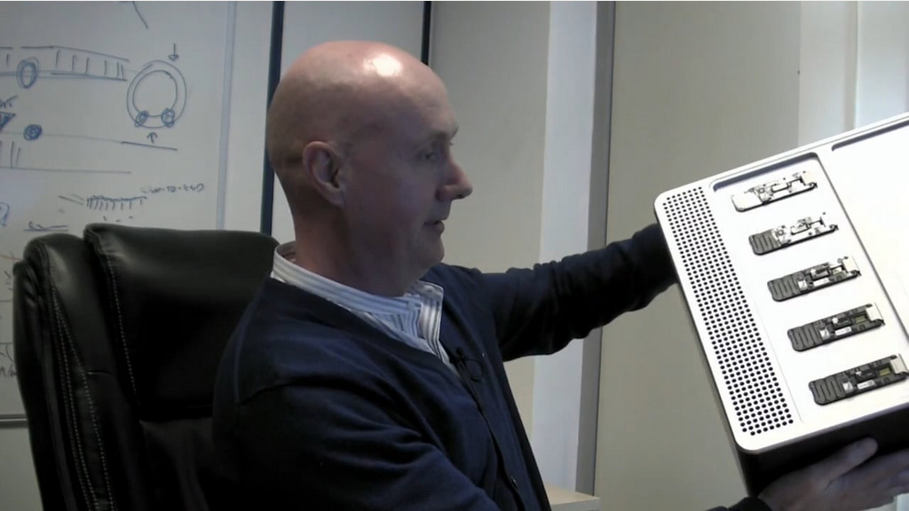

# GridION X5 - The Sequel

A presentation by Clive Brown, CTO Oxford Nanopore Technologies; notes by David Eccles, 2017-Mar-15. See the presentation [here](https://nanoporetech.com/videos/clive-brown-gridion-x5-sequel).

## Preface

* Some people watching this in Australia 3am [and David Eccles in New Zealand at 4am]
* This is Clive's once-yearly update, given shortly before the main conference in May. A few things will be saved for the meeting in London
* Company mission: enable anybody to sequence anything anywhere
* Publications / elsewhere demonstrate that people are already attempting to use the MinION technology in lots of places
* The technology is designed to be used anywhere, with very simple workflows.
* Main device (MinION) is portable, with minimal capital cost
* System is effectively real-time, or very close to real time
* System is demand driven -- can be used, put down and taken up again many times
* Read lengths are intrinsically long, limited only by sample prep
* Accuracy is pretty good, and improving
* Sequencer is good at cDNA; this aspect has probably been undersold
* This talk doesn't cover everything available. Clive Brown has given a few other previous previous talks
* The last google hangout at end of March [2016] is a good place to start

## How nanopore sequencing works

 * proten pore embedded in membrane
 * array of membranes embedded in electrical sensor
 * speed at which sensors measures things is orders of magnitude faster than CCDs
 * after a second, have 1000b read, entirely available for analysis as the run proceeds
 * can pipeline bioinformatics pipelines based on sequencing
 * can make devices work together to a shared goal; methods continue
 * a piece of DNA will give you a reproducable signal that can be decoded into bases
 * currently running R9.4 on mem 10, motor E8 (phenomenally processive helicase)

## decoding signals
 * originally done by HMM
 * explosion in past 2 years around neural networks
 * now good experience decoding signals using NNs
 * many methods in signal processing area that could be used
 * current methods can learn local context over a window

## MinION device
 * At least ~4,000 MinIONs out now
 * Aluminium device
 * Inject liquid sample into system, pores devour sample in real time
 * 512 channels running at once, can get at 450b/s/channel v. high throughput
 * Mark Ib -- no significant improvements planned in MinION

## Technology workflow
 * Clive doesn't like slide: implies linear workflow
 * Need DNA
 * Variety of kits; simplest/snappiest uses transposome complex. On long DNA, can add in adapters; 5-10 mins
 * Lengthiest preps (ligation) take about an hour; working to smooth out variation in sample prep
 * Can take sample out, can flush sample out, can put more in, can muck with sample while it's in the system
 * While running, run NN basecaller
 * Calling can be done on the fly, or post-run
 * Programmable feedback loop; feature to come back with a vengeance in future

## PromethION; elephant in the room
 * Cake-tin sized benchtop sequencer
 * Different ASIC, a few thousand channels, in aggregate 144,000 channels
 * Laid out to be pipette friendly
 * Can put sample in flow cell offline and while running
 * Bottom is compute module, can write data out at full-pelt to external storage
 * Box was designed when running at 30b/s, probably can't handle a full run for real-time basecalling
 * Running at full-pelt can produce a very large 233Gb per flow cell in 48h, 11Tb assuming 100% bandwidth utilisation,
   3x a NovaSeq; right up there in that category of high-througphut sequencers
 * No chance of falling behind; not going out of date before the box is delivered

## On-demand sequencing on PromethION
 * All kinds of workflow tricks to optimise pipelines
 * No need to wait for sample, can run 3 samples, 1 sample, 48, or multiplex
 * Can deal with lumpy demand
 * Turn-around time basically limited by postage
 * Can be shipping data back while running
 * If not enough slots, can just buy more sequencers
 * When fully deployed, will provide significant competitive advantage

## PromethION Flow cell performance
 * A few bad channels, but mostly green
 * Numbers are high, yield numbers high, above the threshold for shipping

## PromethION scaling
 * Not novices for scaling; Gordon worked on Glucose blood strips
 * Working to produce more flow cells

## PromethION performance and yield
 * Key problem to do with flow cell blocking
 * Promethion typically 10Gb in 6 hours, aim >50Gb per flow cell
 * Firmware updates for higher
 * Can probably run for up to 4 days
 * Software mature, run in house all the time, evolution of MinION and GridION software
 * Control in a similar way to MinION, in paralle

## Instrument shipping
 * 1-2 per week, a bit slower than expected
 * expect all backorder done by Q3 (original prediction was Q3 2016)
 * Putting in software that lets ONT do remote firmware updates
 * Ability to swap out hardware/software very quickly

## PromethION Flow cells
 * First shipping 3rd April to 12 sites
 * a little bit of hand-holding, will ramp up rate of flow cell shipping after that
 * Haven't had a single dropout from waiting list
 * target headroom performance is so high that it will not go out of date

## PromethION design change
 * Compute module will not be able to keep up with 1,000 bases per second
 * Need a bigger box, getting too tall
 * Decided to move all of the computing into a separate box
 * Compute module becomes a switch that lets us stream data to a compute room
 * People who want to run multiple promethIONs can cable up and have processing elsewhere
 * Most people put PromethIONs on UPSs anyway, might as well put a compute module there as well
 * Can add in up to 80 TFLOPS of computing in compute module; can handle 1,000 b/s on a fully-running sequencer
 * Will map consensus callers and assemblers in box
 * Can use idle computing for local bioinformatics; e.g. containerised workflows
 * Network requirements much simpler for a single compute box
 * To be rolled out; upgrades included in the cost of purchase

## What's inside the compute box
 * Cramming in FPGAs on PCIe cards, easily 60Mb/s, 80 TFLOPs
 * Allows to fully keep up with real-time basecalling on PromethION
 * Can also implement own proper version of things like read-until

## PromethION evolution
 * Currently 24 flow cells enabled, can dump data to external disk
 * Q4 add compute module to enable all 48 flow cells with local basecalling
 * 2018 additional evolution, rolled into current purchasing

## Base call acceleration
 * NNs are fascinating things
 * Engineers have been able to produce versions that run pretty efficiently on FPGAs
 * Tend to get higher uplift than CPU/GPU; power cost is lower
 * Possible to use stripped-down, mini FPGAs for smaller devices

## Base call acceleration design
 * Typically 1.8 events per base, very high requirements
 * MinION at full output needs 200 GFLOPs
 * writing OpenCL versions of base callers, unlikely to be as optimal as VHDL

## Base call benchmarking
 * Working closely with Intel
 * MinION about 240kb/s
 * Promethion about 65,000 kb/s
 * Can only utilise around 10% of available CPU
 * on GPUs, seem to only be able to use about 2% of GPUs; not a good performance payoff
 * on i7-type CPUs, can process 200,000 bases/s, still only using ~10%
 * on Intel Arria / Stratix, getting to 1M-7.5M called bases per second, using 60% of available processing power
 * pretty confident that this is the way to go

## PromethION base call implementation
 * current generation 9Mb/s, almost a Tb per day currently
 * second generation of cards up to 4Tb of real-time calling per day
 * looked at accelerator for MinION... but you can do that
 * coding in the background a dongle, either separate or intercalated between MinION and computer that will do local basecalling, and stream out reads to the computer

## MinION compute requirements
 * Cloud base calling currently - Clive's fault that ONT did that
 * If you provide a safety net, people start to use it as a hammock
 * Cloud base calling will be discontinued at 21st March
 * MinKNOW now has integrated basecaller which will do it for you
 * A good high-performance laptop will be fine
 * Can just leave computer running, will keep basecalling after finish of run
 * Provide binary base caller
 * Writing to shared drive, another computer can do base calling
 * Most people getting 3-10Gb
 * Theoretical maximum 200kb/s, best internal about 100kb/s
  * laptop CPU can do about 40kb/s base calling
  * MinKNOW can deal with this

## Accuracy / chemistry / algorithm
 * On 1D, R9.4 base calling modal accuracy of just over 90%, maybe a bit higher
 * old 2D system at 250b/s

## Consensus accuracy
 * Basic message: accuracy improving, data amenable to polishing
 * Most errors now falling in / adjacent to homopolymers
 * Will think about releasing optimised consensus callers in a reasonable timeframe

## Homopolymers
 * ONT's unfinished business is held up by detractors; fixed by ONT, then detractors move onto the next unfinished business
 * Scrappie package, learnings are migrating into MinKNOW base calling

## Novel base calling
 * Working from raw data (more about that later)

## Homopolymer
 * Recently held up by competitor as a systematic flaw; just another obstacle to overcome (e.g. black knight in Monty Python)
 * Scrappie doing fairly well, consensus calling of homopolymers can be done using scrappy output
 * not as mature as other callers, but methods will only improve

## Base calling from raw signal
 * Clive hates event calling, has wanted to get rid of it
 * Current base callers just take raw signal, output base calls
 * Neural networks trained to optimally extract features from raw data, architecturally / conceptually better
 * Accuracy improves, scales to faster sequencing speeds
 * Can go straight from raw to FASTQ / SAM, recover about 80% of disk space
 * left with compressible integers in FAST5
 * Developer versions released Easter
 * base calling should just get better and better

## Base caller landscape
 * Clive likes open development
 * Albacore is the production basecaller; can be run offline; fully-supported
 * Nanonet is a research base caller, available under open source, not supported
 * Scrappie is the New Kid on Block, limited support, available to everyone shortly
 * Standard workflow is MinKNOW + onward analysis
 * Can intercalate other basecallers; preferred by power users

## Other accessory tools
 * Lamprey; file-watching wrapper for open-source base callers. Does what old cloud program did
 * If writing to shared drive, or external compute, can use Lamprey for local-cloud-type thing
 * A middle ground between basic and power users

## Throughput
 * Clive took his own blood (with help), sequenced it himself, gets 20G per flow cell
 * Other customers typically between 3-11G; would be nice to get everyone up to 20-30Gb
 * This still only represents about 20-30% of what is possible
 * Lots of reasons, many to do with extraction; people not knowing how much DNA they're putting in
 * Trying to reach into upstream workflow; focusing now on good sample prep

## Software improvements to throughput
 * DNA complex would occasionally wedge on top of pore; takes a few seconds, once in, won't come out
 * If caught quick enough, can do a bit of read-until and flick complex back out of pore
 * This is no longer the limiting factor

## Read length
 * Read length = fragment length
 * If a pore is presented with megabase sequences, it will produce megabase reads
 * Other systems will fail due to photodamage
 * If you can figure out how to get molecules into the system, can produce reads
 * Josh Quick / Nick Loman managed long reads (>750kb), largely by avoiding pipetting
  * have accomplished N50s of 60/70kb
 * Probably no limit; limit is what can be put in. Clive expects 7Mb sequence should be able to be done
 * Some nutcases at ONT think you can do whole chromosomes
 * Need to take what is being learned and make it easier for everybody

## Upcoming improvements for throughput and sensitivity
 * MinKNOW upgrade, improved unblocking
 * Lifetime of flow cell improved by 50%, yield per flow cell and cost per base goes up concommitantly
 * Working on releasing an official read-until
 * Working group looking on samples people are looking at, looking at best library prep to give best output

## Improving / replacing 2D
 * Introduced in NY meeting; phasing out 2D sequencing, replaced with 1D^2
 * 2D has always been a problem; strands covalently joined with hairpin
 * Accuracy plots have quite a different accuracy for template/complement
 * Bad structural effects that bugger-up the basecalled signal
 * can't get speed above 250b/s

## 1D^2
 * 1D prep
 * As template strand is drawn in, other end gets closer and closer to pore
 * Finish first molecule, other molecule is sitting nearby on membrane
 * If second molecule hangs around long enough, it will be processed by the pore
 * This occurs naturally about 1% of the time, no joining between template/complement
 * Trick is to make the second molecule hang around longer

## 1D^2 consensus
 * Accuracy much sharper
 * 2 strands look like and behave like individual molecules

## Traces
 * Open pore current; drop as molecule goes into pore
 * When first molecule is traversed, current goes back up to open pore
 * Second molecule is complement of DNA
 * With some trickery, can make second molecule hang around for longer
 * 60% of data comes in template/complement pairs; expect that ONT can get that higher
 * Can get very high 1D^2 yields at 450b/s

## 1D^2 accuracy
 * Modal accuracy of 97/98%, a proportion are above 99%
 * Long stretches of perfect data
 * Algorithm is not fully optimal
 * Would like modal accuracy to 99%
 * Base-caller was not Scrappie, so at least has homopolymer issues
 * Will need to change to R9.5 pore; better at capturing second signal
 * Can still generate 1D reads
 * consensus calling know what pairs are, helps polishing
 * metagenomics may be more important to look at single molecules
 * expect this will be forwardly-compatible with 1000 bases/s

## 1D^2 release
 * To developers 27th March, developer kit + base caller
 * general release to community 3rd May
 * 2D kits discontinued on 5th May

## New product; MinION well established
 * Over 4,000; just started pushing into China, India, Japan
 * workflow getting better, work to do on input material
 * Aim to make more runnable
 * MinION not licensed for service sequencing; makes sense to Clive & Spike, but not anybody else
 * MinION is your personal sequencer

## Offerings
 * Huge performance gap between MinION and PromethION; bookending the space
 * PromethION might be too large (only 10/20 HiSeq 10)

## GridION
 * Will make GridION X5 available
 * the sequel, because it follows on from both MinION / GridION

## What is GridION
 * Original system that was proposed by Clive / ONT
 * Designed around loading membranes in the lab; tore up design in 2011 to change to loading at ONT
 * Concept is sound: large arrayable computers that can work together or individually on samples
 * For a long time, GridION wasn't taken off website

## GridION X5
 * Bench-top format, a big MinION
 * 5 individually-addressable flow cells
 * Inside, taken PromethION developments and shrunk down
  * FPGAs inside, real-time base calling for up to 1000b/s for 5 flow cells
 * Everything is in the box
 * Allows for small group-level or service sequencing

## GridION Production
 * All mature, in build
 * Very highly-manufacturable design
 * In the zone

## GridION Pricing
 * Two ways to buy: capital loaded, consumable loaded
 * Capital commitment of $125k, flow cells $300
 * Licensed for use as fee for service
 * At 10G per flow cell, $30 per Gb; at 20G/flow cell $15/Gb
 * Capital-free model $475 per flow cell with support fee
  * $47 per Gb at 10Gb per flow cell, $24 per Gb at 20Gb per flow cell

## Also Nanopore service certified
 * Institute-wide service
 * will run training and QC certification process; contact support
 * enables you and customers to know that samples can be processed

## Summary tables for 3 products
 * Should be product info on website

## Shop opens for GridION next week
 * Expect to ship devices in May at the latest

## Dates
 * March
  * 1D^2 with developers
  * Lamprey developer release
  * Cloud base calling discontinued on 21st
 * April
  * Transducer (MinKNOW HP fix) on 20th
 * May
  * Broader 1D^2 release (3rd May)
  * GridION flow cells 15th
  * 2D gone on the 5th

## Lots of things Clive hasn't spoken about
 * A lot covered in more detail in London
 * Devlopment on targeted CAS9
 * Massively improving array sensitivity
 * CliveOME (replaced, with ultra-long reads)
  * wants to see about enriching immunoglobulin regions
  * wants centromere-spanning reads
 * Zumbador looking really exciting
  * has to become from a drop of blood to a genome
 * Flongle / SmidgION
 * Metrichor / Epi2Me; becoming completely separate from Nanopore

## Questions
 * Devices for service: yes, but not MiNION
 * System suitable for 16s
 * Error rate improving
 * Guaranteed performance metrics: certification scheme will probably include this; should talk to Louisa
 * Scrappie avialable for developer licenses, some in MinKNOW
 * PromethION compute box can be made rack-mountable (part of roadmap, but need to see demand first)
 * Switch box / old compute module can have different output options
 * Optiomal temperature for sequencing - temp rises, sequencer runs quickly
   * probably no problem at 50 degrees, not sure about colder
 * Lifetime for flow cells * up to 4 days
 * How much DNA is needed to make 20Gb?
  * answer will be forthcoming
 * MinION is available now in China
 * Preparation of 1Mb DNA: look at Nick Loman's blog; just be gentle
 * MinION on 3rd April - can draw down latest pore or not
  * same base-callers work on both pores; just rate of capture
 * Consumable & Capital models are both available in parallel
 * No need to implement PromethION technology on MinION
  * expect to improve throughput to 1000 bases/s
  * in principle 40Gb/day (60Gb/day theoretical max)
 * complement distorts DNA signal, probably by stretching
 * segmentation - no methods to deal with this yet, but nothing scary
 * Plan for clinical MinION use? probably
 * How close to routine culture-free WGS? Zumbador problem; probably pretty close
  * can pop cells, tagment
  * problem is sensitivity
  * in principle, if they can get to the membrane, will see a lot of them
  * trying to improve array sensitivity to deal with low inputs
  * drop of blood / spit into tube, wait 10 mins
 * Conversion of ONT terminology
  * Clive used Molarity when he did molecular biology
  * significant stumbling block for people
 * PromethION service fee - chat with ONT service team
 * PromethION based on R9.5 pores? No one has run PromethION/GridION in field
  * they will only ever be 1D or 1D squared
 * MinION accuracy for short fragments
  * pore accuracy is independent of length
  * aiming to remove capture advantage for short reads
