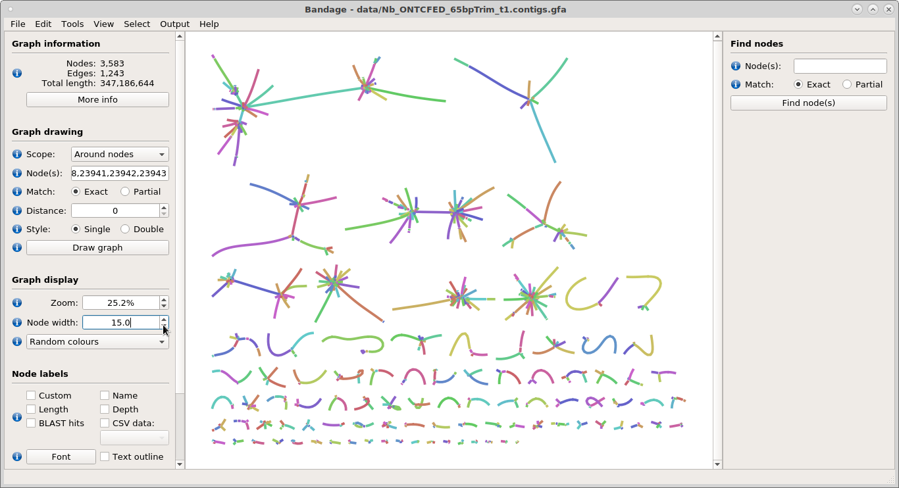
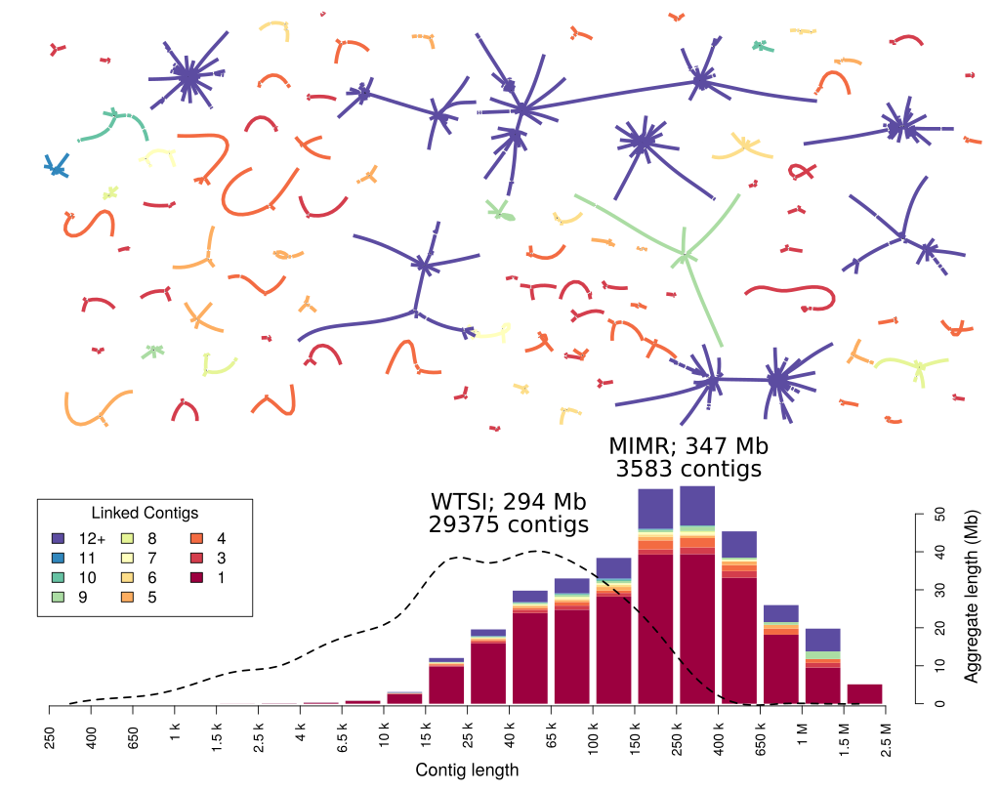

# Genome Firework Plot

A tutorial by David Eccles about representing a genome in a visually-interesting form. This tutorial describes a process for generating an image similar to the following:

## Preparation

This tutorial uses the GFA file produced by [Canu](https://github.com/marbl/canu/releases). Specifically, the GFA file produced from our attempt at a _Nippostrongylus brasiliensis_ (_Nippo_) genome assembly:

* [GFA file](data/Nb_ONTCFED_65bpTrim_t1.contigs.gfa.gz)
* [Genome assembly](https://www.ebi.ac.uk/ena/data/view/GCA_900200055) (for reference, not used in this tutorial)

The final image also includes length data from the existing NCBI [_Nippo_ genome assembly](http://parasite.wormbase.org/Nippostrongylus_brasiliensis_prjeb511/Info/Index/) that was assembled by the [Wellcome Trust Sanger Institute](http://www.sanger.ac.uk/):

* [PRJEB511 length data](data/lengths_Nb_WTSI.txt.gz)

This length data was generated from the *Nippo* assembly by using the `fastx-length.pl` script from my [bioinf-scripts](https://github.com/gringer/bioinfscripts) repository:

    /bioinf/scripts/fastx-length.pl PRJEB511.WBPS9.genomic.fa | \
      gzip > data/lengths_Nb_WTSI.txt.gz
    
_Note: when the location `/bioinf/scripts/` is used in subsequent steps, it refers to the above repository_

The contig length information was extracted from the GFA plot and converted into the same space-separated `<length> <id>` format:

    gunzip data/Nb_ONTCFED_65bpTrim_t1.contigs.gfa.gz
    grep '^S' data/Nb_ONTCFED_65bpTrim_t1.contigs.gfa | \
      awk '{sub("LN:i:","",$4); print $4,$2}' | \
      gzip > data/lengths_ONTCFED.txt.gz

This tutorial also uses [R](https://www.r-project.org), [Bandage](https://rrwick.github.io/Bandage/), and [Inkscape](https://inkscape.org):

 * https://www.rstudio.com/products/RStudio/ -- RStudio, an R user interface
 * https://rrwick.github.io/Bandage/ -- Bandage homepage
 * https://inkscape.org/release/ -- Inkscape download page

## Initial Concept Image

Most of the concepts required to make one of these plots from an arbitrary assembly are already available in my own length histogram R script and in Bandage:

    /bioinf/scripts/length_plot.r -h lengths_ONTCFED.txt.gz

Here is what the resulting `MinION_Reads_SequenceHist_ONTCFED.png` looks like:

Bandage will produce, by default, an image of *all* contigs:

    ~/install/bandage/Bandage load Nb_ONTCFED_65bpTrim_t1.contigs.gfa
    

Click on the 'Draw Graph' button at the left to display the contigs:

To save as an SVG image, use `File -> Save image (entire scene)`, choose 'SVG' as the file type, and change the extension in the _Name_ box to `.svg`:

This SVG image can then be loaded up in Inkscape and the *Page* exported as a PNG file via `File -> Export PNG image...`. Here the width of the exported image has been set to 1024 pixels:

Resulting in the following image:

_Note: The intermediate Inkscape step is used (rather than exporting directly to PNG from Bandage) because subsequent steps will use Inkscape to modify the image._

## Counting Links

The GFA file needs to be processed to work out the number of contigs in linked subgraphs of the assembled genome. The `igraph` package is very useful for this. The only thing needed is the linking between one contig and the next, so some initial processing with `awk` is done to make the loading easier. Link lines (beginning with `L`) are extracted, and the second and fourth fields are extracted (containing contig names). Some links appear more than once in the Canu GFA output, so an additional pass through `uniq` is carried out:

    grep '^L' data/Nb_ONTCFED_65bpTrim_t1.contigs.gfa | \
      awk '{print $2,$4}' | sort | \
      uniq > data/Nb_ONTCFED_65bpTrim_t1_contigLinks.txt

This can then be loaded into R and converted into an undirected graph. The links are filtered to remove contigs that link to themselves:

    > library(igraph);
    > links.df <- 
    +   read.table("data/Nb_ONTCFED_65bpTrim_t1_contigLinks.txt",
    +     col.names=c("from","to"), stringsAsFactors=FALSE);
    > links.df <- subset(links.df, !(from == to));
    > links.graph <- graph.data.frame(links.df, directed=FALSE);

The clusters containing subgraphs are identified. The `table` function is used to identify where to put the breaks for the histogram, and shows that beyond 11, the number of links in a graph is very large and might as well just be "lots":

    > links.clusters <- clusters(links.graph);
    > table(links.clusters$csize);
    
R Output:

      2   3   4   5   6   7   8   9  10  11  26  27  34  38  41 
    149  55  22  14   6   3   2   4   2   1   1   1   1   1   1 
     57  76 106 
      1   1   1 

The association between contig names and subgraph cardinality is stored in a new data frame:

    > contig.links.df <- 
    +    data.frame(contig=names(links.clusters$membership),
    +               linkID=links.clusters$membership);
    > contig.links.df$card <- 
    +    links.clusters$csize[contig.links.df$linkID];

The comma-separated list of contigs can be stored in a file for filtering with Bandage. Bandage removes the initial `tig` and leading zeroes, so these are removed as well for the output file using `sub`:

    > cat(sub("^tig0*","",contig.links.df$contig), sep=",",
    +     file="data/linked_contigs.txt");

However, on loading these into Bandage via `Graph drawing -> Scope: Around nodes`, it is apparent that there are still too many "boring" subgraphs, where the contigs are linked in an unambiguous fashion:

Fixing this requires paying a bit more attention to the link structure of the GFA plot. It will be assumed that any contigs involved in these links will be treated as "linear / unlinked".

## Counting Non-trivial Links

In this case, the direction of the link is preserved, so that the associated contig end can be identified. A subgraph is considered "complex" if it contains at least one non-trivial link, i.e. if the same contig end is linked to more than one contig. Again, the link lines in the GFA graph are filtered, but this time showing direction:

    grep '^L' data/Nb_ONTCFED_65bpTrim_t1.contigs.gfa | \
      awk '{print $2,$3,$4,$5}' | sort | \
      uniq > data/Nb_ONTCFED_65bpTrim_t1_contigLinksDir.txt

A bit of preprocessing is needed in R. The contig names will be appended with `_S` or `_E`, depending on which end of the contig is linked, which changes depending on whether it is a `+` or `-` connection, and whether the contig appears on the left-hand side or the right-hand side. Canu will occasionally produce conjugate duplicates, where there is a duplication of a link between two contigs in the reverse direction. This is worked around by alphanumerically ordering the from and to fields of each row.

Complex contig joins are identified by looking for duplicates. Finally, start and end contig fragments are linked to ensure that they appear in the same contig cluster.

    library(igraph);
    links.df <- 
    read.table("data/Nb_ONTCFED_65bpTrim_t1_contigLinksDir.txt",
      col.names=c("from", "fromDir", "to", "toDir"), 
      stringsAsFactors=FALSE);
    links.df$fromSig <- paste0(links.df$from,
      ifelse(links.df$fromDir == "+", "_E", "_S"));
    links.df$toSig <- paste0(links.df$to,
      ifelse(links.df$toDir == "+", "_S", "_E"));
    links.df[links.df$fromSig > links.df$toSig,
      c("fromSig","toSig")] <-
      links.df[links.df$fromSig > links.df$toSig,
        c("toSig","fromSig")];
    newLinks.df <- unique(data.frame(
      from=links.df$fromSig,
      to=links.df$toSig, stringsAsFactors=FALSE));
    complex.contigs <- 
      names(which(table(c(newLinks.df$from, newLinks.df$to)) > 1));
    complex.contigs <- unique(sub("_[SE]$","",complex.contigs));
    contigNames <- unique(c(links.df$from, links.df$to));
    newLinks.df <- 
      unique(rbind(newLinks.df, 
        data.frame(from=paste0(contigNames, "_S"), 
        to=paste0(contigNames, "_E"))));
    links.graph <- graph.data.frame(newLinks.df, directed=FALSE);

Again the `clusters` function is used, but the `csize` value can no longer be used because of both sides of contigs appearing in the same cluster:

    links.clusters <- clusters(links.graph);
    names(links.clusters$membership) <-
      sub("_[SE]$","",names(links.clusters$membership));
    links.subgraphs <- tapply(names(links.clusters$membership),
      links.clusters$membership, function(x){
        unique(sub("_[SE]$","",x));
      });
    table(sapply(links.subgraphs,length));

R output:

      1   2   3   4   5   6   7   8   9  10  11  26  27  34  38 
      4 149  55  22  14   6   3   2   4   2   1   1   1   1   1 
     41  57  76 106 
      1   1   1   1 

The clusters containing interesting branches are identified by the presence of a complex contig within the cluster:

    complex.subgraphs <- 
      Filter(function(x){any(x %in% complex.contigs)},
        links.subgraphs);
    cat(sub("^tig0*","",unlist(complex.subgraphs)), sep=",",
      file="data/linked_complex_contigs.txt");

Now it looks like only branched subgraphs are shown in the node subset, so this Bandage plot can be saved as an SVG file to be dealt with later. The node width is set to 15 to make the contigs easier to see in the combined plot:

## Creating the Length Histogram

This histogram will be created from scratch, to demonstrate the operations involved. To simplify things, the histogram for the existing WTSI assembly (which has no link information) will be plotted first. Read lengths are split into bins of roughly equal width in logarithmic space, then lengths (not counts) aggregated within each bin. A bar plot is generated, with a fitted curve over the top of it:

    wtsi.lengths <- read.table("data/lengths_Nb_WTSI.txt.gz")[,1];
    fib.divs <- round(10^((0:4)/5) * 2) * 0.5;
    histBreaks <- round(rep(10^(0:16),each=5) * fib.divs);
    lengthRange <- range(wtsi.lengths);
    histBreaks <- histBreaks[(which.min(histBreaks < lengthRange[1])-2):
                             (which.max(histBreaks > lengthRange[2])+1)];
    wtsi.bases <- 
      tapply(wtsi.lengths, cut(wtsi.lengths, breaks=histBreaks), sum);
    wtsi.bases[is.na(wtsi.bases)] <- 0;
    par(cex=1.5);
    b.res <- barplot(wtsi.bases / 10^6, xaxt="n", names.arg=NA,
      las=2, ylab="Aggregate length (Mb)");
    points(spline(b.res, wtsi.bases/10^6, n=6*length(b.res)), type="l",
      lty="dashed", lwd=2);

This plot is missing an X axis, which looks nicer with tick marks between the bars to explicitly state the binning boundaries. SI prefixes are used to reduce the space taken up by numbers:

    valToSci <- function(val, unit = ""){
        sci.prefixes <- c("", "k", "M", "G", "T", "P", "E", "Z", "Y");
        units <- rep(paste(sci.prefixes,unit,sep=""), each=3);
        logRegion <- floor(log10(val))+1;
        conv.units <- units[logRegion];
        conv.div <- 10^rep(0:(length(sci.prefixes)-1) * 3,
          each = 3)[logRegion];
        conv.val <- val / conv.div;
        conv.val[val == 0] <- 0;
        conv.units[val == 0] <- unit;
        return(sprintf("%s %s",conv.val,conv.units));
    }
    b.int <- b.res[2]-b.res[1];
    axis(1, 
      at=seq(c(head(b.res,1))-b.int/2,
      c(tail(b.res,1))+b.int/2, by=b.int),
      labels=valToSci(histBreaks), las=2);

So that's the general idea for the length histogram. Time to switch over to the new genome assembly and split by contig link count using the subgraphs previously identified. If any link count is 12 or more, it is set to 12.

    cfed.lengths <- read.table("data/lengths_ONTCFED.txt.gz", 
      row.names=2, col.names=c("length","contig"));
    complex.df <- data.frame(contig = unlist(complex.subgraphs),
      stringsAsFactors=FALSE);
    complex.df$links <- rep(sapply(complex.subgraphs, length),
      sapply(complex.subgraphs, length));
    cfed.lengths$links <- 1;
    cfed.lengths[complex.df$contig,"links"] <- complex.df$links;
    cfed.lengths[cfed.lengths$links > 12,"links"] <- 12;

## Colouring In
    
Now it's just a matter of using the link counts in a bar plot, adding a splash of colour, and overlaying the WTSI scaffold lengths as in the previous step. The `RColorBrewer` package is used to generate a reasonable gradient, which is then ripped to pieces to allow for an arbitrary length by feeding through the `colorRampPalette` function. The file is saved as SVG to make it look nicer when manipulating in Inkscape:

    library(RColorBrewer);
    lengthRange <- range(c(wtsi.lengths,cfed.lengths$length));
    fib.divs <- round(10^((0:4)/5) * 2) * 0.5;
    histBreaks <- round(rep(10^(0:16),each=5) * fib.divs);
    histBreaks <- histBreaks[(which.min(histBreaks < lengthRange[1])-2):
                             (which.max(histBreaks > lengthRange[2]))];
    split.lengths <- sapply(tapply(cfed.lengths$length, 
      cfed.lengths$links, function(lengths.sub){
        tapply(lengths.sub, cut(lengths.sub, breaks=histBreaks), sum);
      }),c);
    split.lengths[is.na(split.lengths)] <- 0;
    bcols <- colorRampPalette(brewer.pal(11,"Spectral"))(
      ncol(split.lengths));
    colnames(split.lengths)[ncol(split.lengths)] <- 
      paste0(colnames(split.lengths)[ncol(split.lengths)],"+");
    svg("pics/barplot_CFED.svg", width=12, height=4);
    par(mar=c(4.5,0.5,2,4.5), cex.lab=1.3);
    b.res <- barplot(t(split.lengths) / 10^6, xaxt="n", yaxt="n",
      las=2, ylab="Aggregate length (Mb)", col=bcols, border=NA,
      legend.text=colnames(split.lengths),
      args.legend=list(x="topleft", inset=c(0.02,0.06), ncol=3,
        title="Linked Contigs", cex=1.2));
    axis(4);
    mtext("Aggregate length (Mb)", side=4, line=3, cex=par("cex.lab"));
    wtsi.bases <- 
      tapply(wtsi.lengths, cut(wtsi.lengths, breaks=histBreaks), sum);
    wtsi.bases[is.na(wtsi.bases)] <- 0;
    points(spline(b.res, wtsi.bases/10^6, n=6*length(b.res)), type="l",
      lty="dashed", lwd=2);
    b.int <- b.res[2]-b.res[1];
    axis(1, 
      at=seq(c(head(b.res,1))-b.int/2,
      c(tail(b.res,1))+b.int/2, by=b.int),
      labels=valToSci(histBreaks), las=2);
    mtext("Contig length", side=1, line=3.5, cex=par("cex.lab"));
    invisible(dev.off());

## Combining Bandage Plot and Histogram

The next steps are a matter of mostly-manual "stamp collecting" in Inkscape to finish off the combined plot. The branched Bandage graph is imported into the barplot SVG file [`File -> Import...`], then resized to be about two thirds of the width of the bar plot.

The imported bandage plot is ungrouped [`<Ctrl> + <Shift> + G`], and individual contigs subgroups selected by dragging windows around them and grouping [`<Ctrl> + G`]. Zooming in and out with `+` and `-` respectively can help for this step. Zooming out to the entire drawing with `3` may also be useful. It's also possible to zoom in an out by holding down `<Ctrl>` and using the scroll wheel on a mouse, which will centre the zoom region on the mouse cursor. Scrolling around the image vertically can be done by using the scroll wheel, and scrolling horizontally by holding `<Shift>` and using the scroll wheel (or using a 2D scroll wheel, if that luxury is available).

Note that Inkscape selection by default requires the entirety of an object to be surrounded by a dragged window before it will be selected, so a window boundary can start in a blank area within an existing grouped object and include part of that object without selecting any of it:

The graph is ungrouped [`<Ctrl> + <Shift> + G`] to allow grouping of the graph key [`<Ctrl> + G`], which is then duplicated [`<Ctrl> + D`] and moved to more a convenient location nearer to the bandage subgraphs. This will be used as a colour palette for the eyedropper tool when colouring subgraphs and moved around as different subgraphs are coloured.

Subgraphs will be coloured based on the graph key. Due to the thresholding for the graph, it is only necessary to count to 12. Select [`s`] a subgraph, then use the eyedropper tool [`d`] and clicking on the appropriate box with the left mouse button. It's possible to change back to the selection tool by either choosing it directly [`s`], pressing the eyedropper key again [`d`], or pressing `<Esc>`. If a mistake is made, the last operations can be undone by the undo operation [`<Ctrl> + Z`], and redone using the redo operation [`<Ctrl> + Y`].

When it's difficult to work out how many contigs there are in a subgraph, the contigs can be shifted around by selecting them without ungrouping using `<Ctrl>` and clicking with the left mouse button, then dragging the contig away. Once a subgraph has been appropriately uncovered and counted, the move operation(s) can be undone by repeated use of [`<Ctrl> + Z`].

## Going Out With a Bang

Once all the subgraphs have been recoloured, the key can be deleted. Shift a few subgraphs around so that the total width of the bandage plot area is the same as the graph below, with subgraphs roughly filling up the entire area.

Select all the subgraphs. Open up the *Align and Distribute* dialog box via `Object -> Align and Distribute...`, or [`<Ctrl> + <Shift> + A`], and click on the the `Randomize centres in both dimensions` icon within the `Rearrange` group. Click a few times on the `Unclump objects` icon right next to that.

Manually shift subgraphs that were difficult to automatically unclump, and reposition them as desired. It might be helpful to disable object snapping [`%`] while doing this. Add in additional labels as desired (e.g. the genome length and contig count). Finally, adjust the boundaries of the page to fit the image via `File -> Document Properties...` then `Resize page to content...`, putting in a 10pt margin for all four sides.

The combined image can then be either saved as a scalable SVG (e.g. for posters) via `File -> Save As...`, or saved as a PNG image, using `File -> Export PNG Image...` as before. A white rectangle can be placed underneath everything to produce a white (rather than transparent) background, if desired. This will produce something like the following:

